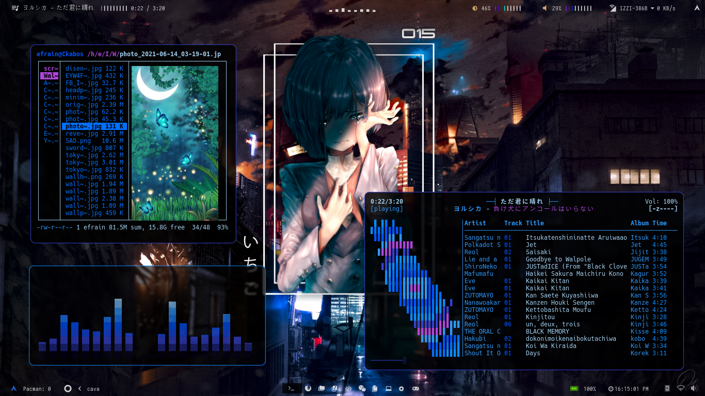

# Dotfile Trans





<!-------------------------------------------------------------------------------------->

# Dependencies

- **`Polybar`** : Configurations bars.
- **`Rofi`** : For rofi-bluetooth, rofi launcher and rofi theme selector.
- **`MPD`** : For audio client with ncmpcpp player.
- **`Bspwm`** : Window Manager
- **`Sxhkd`** : Keybindings.
- **`Nerd Fonts`** : Fonts to the customization.
- **`URxvt`** : Terminal customization with .Xresources file.
- **`Cava`** : Virtualizer Audio

# Icon fonts

- **`Iosevka Nerd Font`**
- **`Material Icons`**
- **`Hack Nerd Fonts`**

# Fonts

- **`Hack Nerd Fonts`**
- **`unifont`**

### Installation

- First, clone the repository. 

```
$ git clone https://github.com/Ckabos/dotfile-trans.git
```

- copy the files in the directories appropriate:

```
$ cp -r polybar ~/.config/
$ cp -r dunst ~/.config/
$ cp -r mpd ~/.config/
$ cp -r ncmpcpp ~/.config/
$ cp -r compton ~/.config/
$ cp -r ranger ~/.config/
$ cp -r bspwm ~/.config/
$ cp -r zathura ~/.config/
$ cp -r rofi ~/.config/
```

